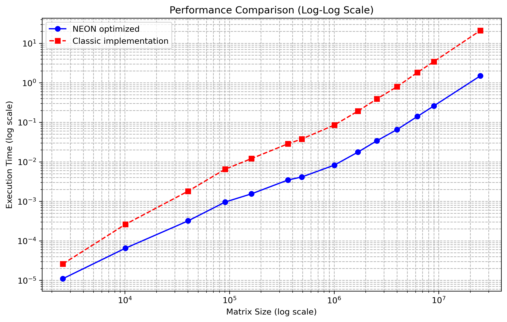

# Easy-Tensor-Compiler



## Запуск проекта

1. Перейдем в папку ```build```

   ```sh
   mkdir build

   cd build
   ```

2. Далее выбираем с какими настройками собирать проект.

   Есть два варианта ```DEBUG``` с оптимизацией ```O0``` и ```RELEASE``` с оптимизацией ```O3```:

   ```sh
   cmake -DCMAKE_BUILD_TYPE=Debug ..

   make
   ```

   или

   ```sh
   cmake -DCMAKE_BUILD_TYPE=Release ..

   make
   ```

3. В результате будет создан исполняемый файл MAIN

   ```sh
   ./MAIN
   ```

4. После запуска будет создан файл ```benchmark_data.txt``` с результатами тестов

5. Перейдём в директорию проекта и запустим скрипт для построения графиков(убедитесь, что у вас установлен ```numpy``` и ```matplotlib```)

   ```sh
   cd ..

   python3 graphs.py
   ```

6. В результате будут построены и сохранены в папку ```data``` графики результатов эксперимента в разных масштабах

## Что реализовано

Есть две реализации матричного умножения: наивнвя и с использованием векторных операций для архитектуры ```arm```

Важно **Программа будет работать только на устройстве с архитектурой arm**
